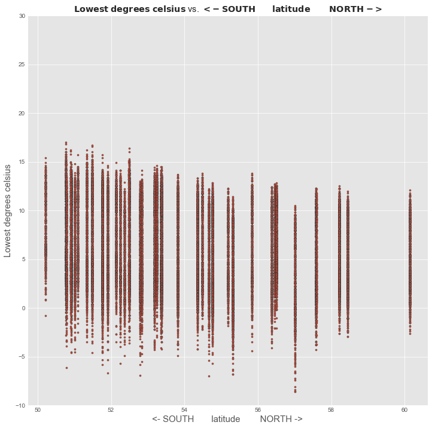
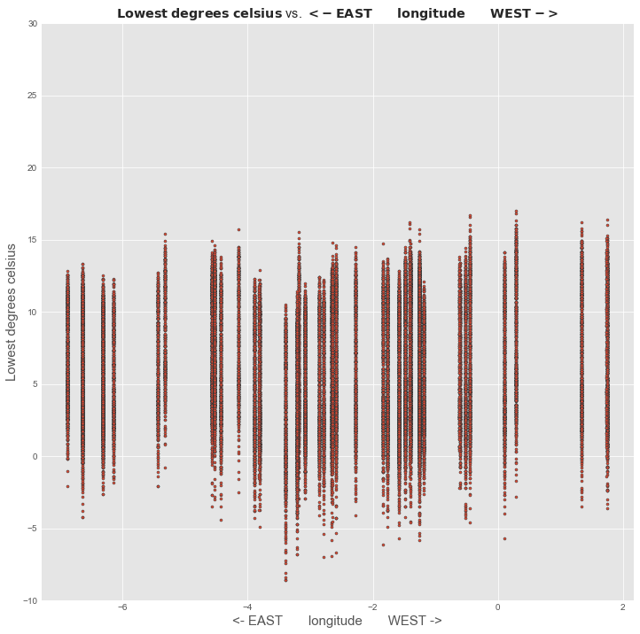
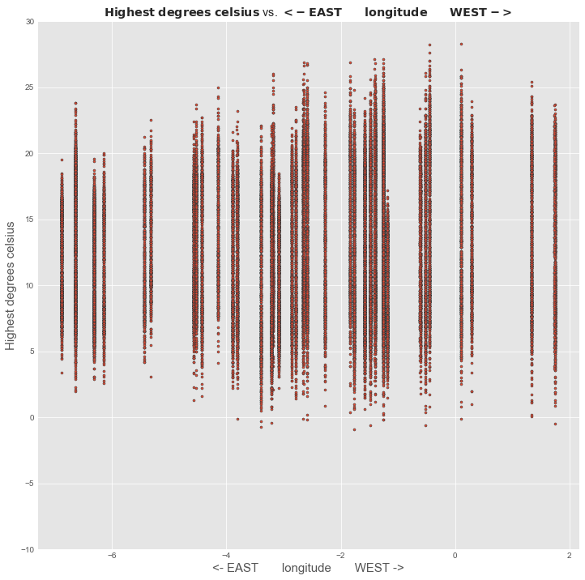

---

---

---

---

---

---

---

---

---

---

---

---

---

---

---

---

---

---

---

---

---

---

---

---

---

---

---

---

---

---

---

---

---

---

---

---

---

---

---

---

---

Source data used is [public sector information licensed under the Open Government Licence v3.0.](https://data.gov.uk/dataset/historic-monthly-meteorological-station-data)